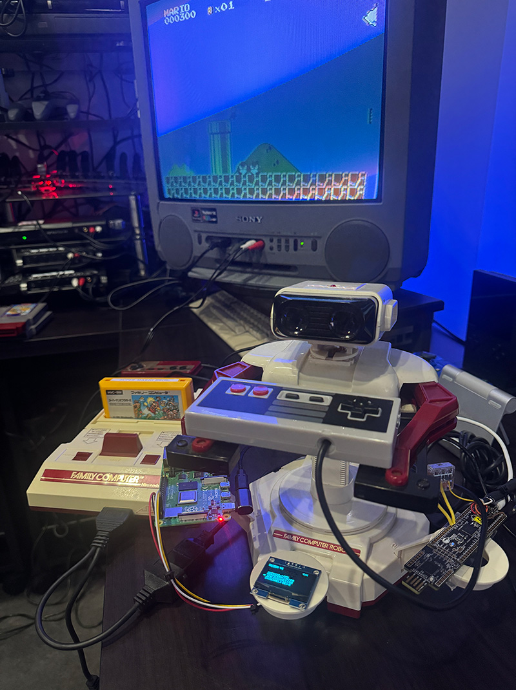
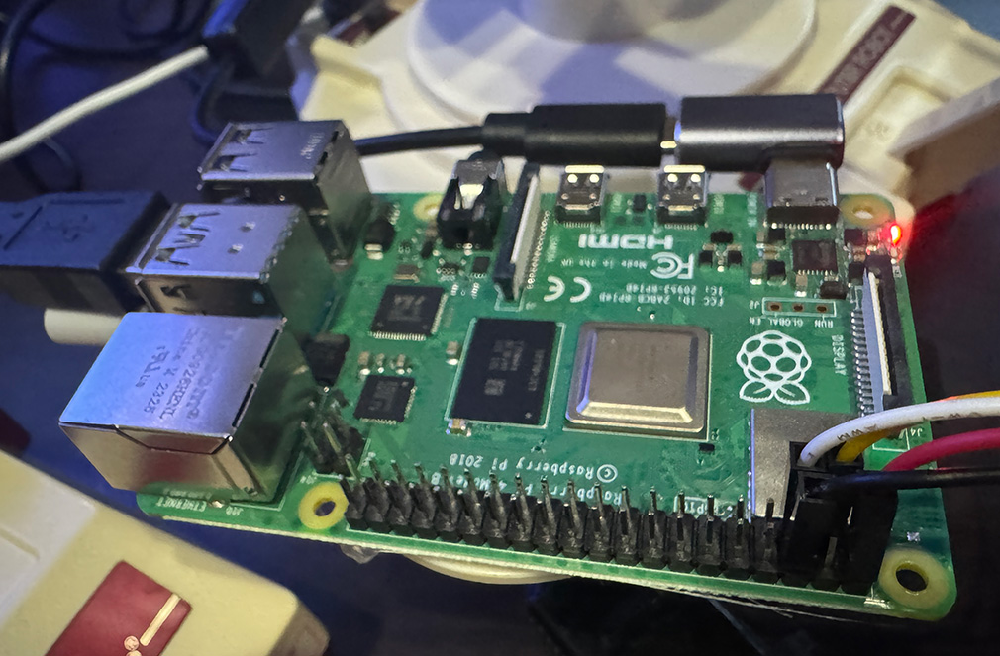
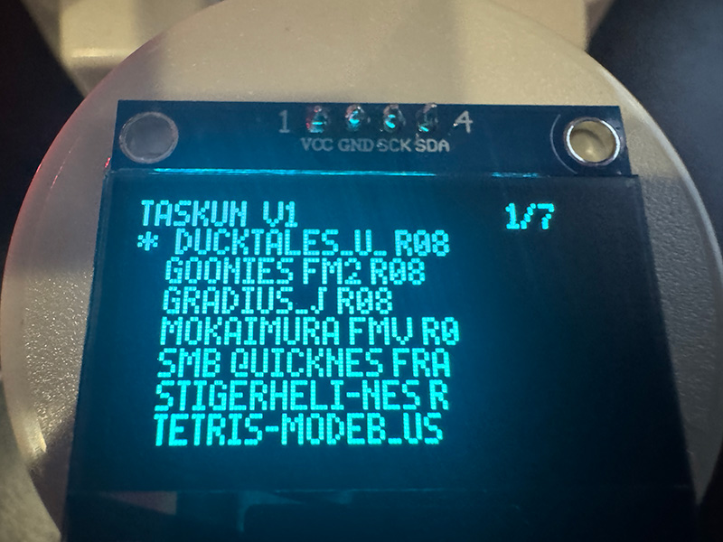
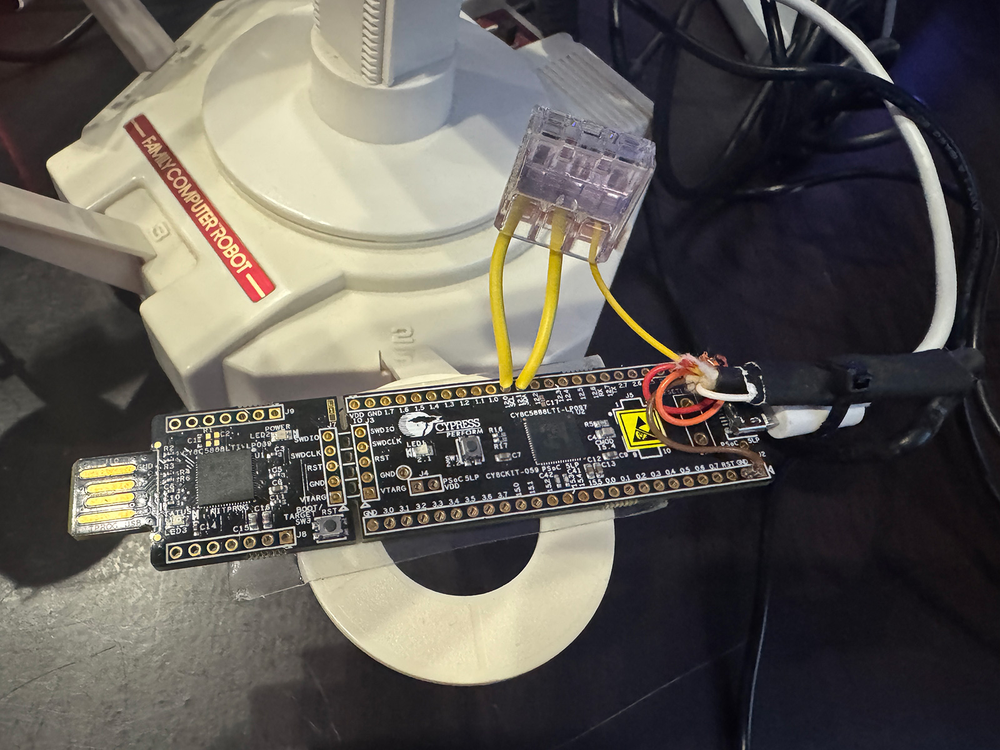

# TASkun, a little stand-alone machine (pi+CY8CKIT-509) that plays back tool assisted speedruns on a real Famicom/NES



A Raspberry Pi-based system based on tewtal's [TAS console replay device](https://github.com/tewtal/tasbot) but with added OLED display, joystick navigation and some other misc changes.

This was just a quick little thing I made for a meetup, I don't recommend anybody work from the code, but I like to put stuff online so here we go.

Note:  It can take a few tries to get a replay to start right, the OLED gives instructions on how to push the Famicom reset button after turning the game on which starts kind of frozen.  If you start the mario TAS and he isn't looking left as he jumps right on the first two jumps, something is wrong, restart it.  If he is, it will work right, he'll be able to do the "wiggle through solid blocks" thing and rescue Peach (8-4) twice.

The OLED and its USB joystick aren't actually required, W/S and Enter can be used to control everything too, but the OLED thing is nice because I don't want a keyboard/monitor required to use it. (ssh works as well)

I stuck the stuff on to R.O.B. (well, the Japanese version) to look cool, he doesn't really do anything.  The USB NES style controller he's using is plugged into the Pi and can be used to select the game replay.  (it needs to match the cart in the Famicom)

## Features
- Interactive OLED menu for selecting .r08 replay files
- USB gamepad support for navigation
- Auto-start service for standalone operation
- Visual feedback during playback



## Requirements
- Raspberry Pi with I2C-enabled OLED display (SSD1306) (I used a Pi4, but because the hardcore timing stuff is handled by the CY8CKIT-059, probably any Pi would work)
- CY8CKIT-059 (PSoC 5LP) flashed with firmware from [tewtal/tasbot](https://github.com/tewtal/tasbot)
- USB gamepad for menu navigation
- NES console and controller port adapter

## Hardware Connections

### OLED Display Setup
- **Display**: 1.3" I2C OLED (SSD1306)
- **I2C Address**: 0x3c (can be verified with `i2cdetect -y 1`)
- **I2C Bus**: 1



#### Pin Connections:
| OLED Pin | Raspberry Pi Pin | GPIO |
|----------|------------------|------|
| VCC      | 3.3V             | -    |
| GND      | GND              | -    |
| SDA      | Pin 3            | GPIO2 |
| SCL      | Pin 5            | GPIO3 |

Make sure I2C is enabled on your Raspberry Pi:
```bash
sudo raspi-config
# Navigate to Interface Options → I2C → Enable
```

### PSoC 5LP Setup


I followed the [instructions here](https://github.com/tewtal/tasbot) to flash and wire the 5LP to the NES controller port.


## Installation
```bash
pip3 install pyserial psutil pillow smbus2
sudo cp taskun.service /etc/systemd/system/
sudo systemctl enable taskun.service
```

## Usage
Place .r08 files in the `tasmovies/` directory and run:
```bash
python3 taskun_r08.py
```

## Credits

- Base 5LP TASBot firmware and python code that actually plays the TAS: [tewtal/tasbot](https://github.com/tewtal/tasbot)
- OLED menu system and Pi adaptations: Seth A. Robinson (me)
- BizHawk and FCEUX, these were used to convert various TAS formats to .r08 format.  More info [here](https://tasvideos.org/ConsoleVerification/Guide#Scripts).
- Thanks to TASVideos.org for the replays (some I renamed to fit the OLED, most I converted to .r08 format):

  - gradius_j.r08 converted from Gradious (J) adelikat-gradius.fcm
  - Ghost 'n Goblins (J) converted from mokaimura.fcm ( by Morimoto )
  - Tiger Heli (U) converted from adelikat,thunderaxe31-tigerheli-nes.bk2
  - The Goonies converted from Phil in 02:31.38 https://tasvideos.org/1373M
  - Duck Tales (U) converted from aglar2-ducktales.fm2 https://tasvideos.org/1267M
  - Super Mario bros replay is from https://github.com/dwangoac/TASBot-Projects/blob/master/replayfiles/smb.quicknes.frame.r08

- Special thanks to [dwangoAC](https://github.com/dwangoac/TASBot-Projects), keeper of TASBot

### License
Hmm, I don't see any license on [tewtal's project](https://github.com/tewtal/tasbot) (what this is based on) - I'll just say my added parts are licensed under [Unlicense](https://en.wikipedia.org/wiki/Unlicense), do whatever.

## Find Seth here:
- **Website**: [rtsoft.com](https://rtsoft.com)
- **YouTube**: [@RobinsonTechnologies](https://youtube.com/@RobinsonTechnologies)
- **Twitter/X**: [@rtsoft](https://twitter.com/rtsoft)
- **Bluesky**: [@rtsoft.com](https://bsky.app/profile/rtsoft.com)
- **Mastodon**: [@rtsoft@mastodon.gamedev.place](https://mastodon.gamedev.place/@rtsoft)

*This project was developed with assistance from AI tools for code generation and documentation.*